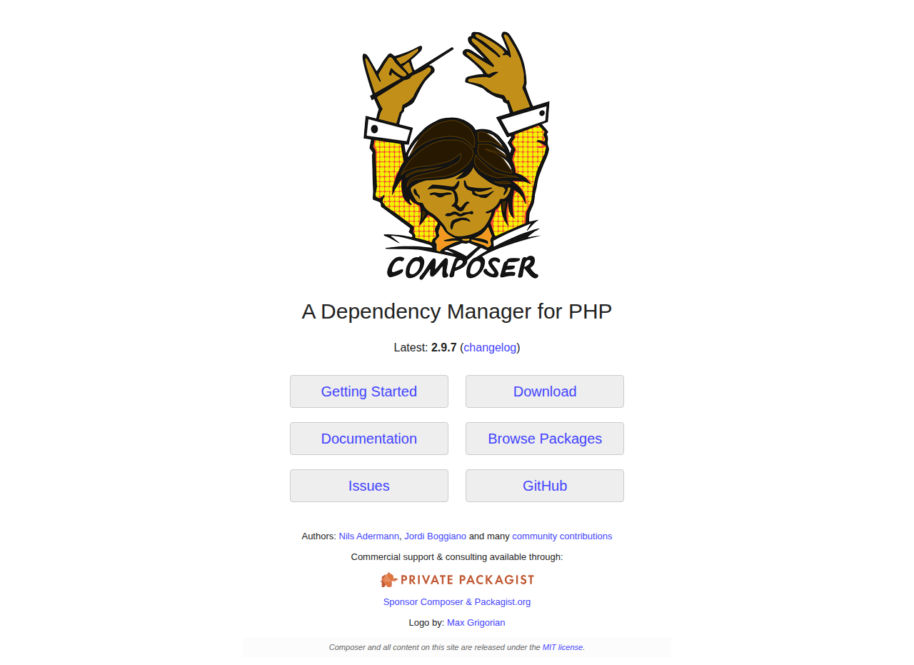

# Visited: https://getcomposer.org
**Time:** Mon May 11 06:25:37 UTC 2026

## Screenshot

## Raw HTML
[page.html](./page.html)

## Downloaded Media (2 files)
## Downloaded Media Files

## Other Links
- [https://getcomposer.org/build/app.css?v=2](https://getcomposer.org/build/app.css?v=2)
- [https://getcomposer.org/build/app.js?v=3](https://getcomposer.org/build/app.js?v=3)
- [https://getcomposer.org/changelog/2.9.7](https://getcomposer.org/changelog/2.9.7)
- [https://getcomposer.org/doc/](https://getcomposer.org/doc/)
- [https://getcomposer.org/doc/00-intro.md](https://getcomposer.org/doc/00-intro.md)
- [https://getcomposer.org/download/](https://getcomposer.org/download/)
- [https://getcomposer.org/sponsor/](https://getcomposer.org/sponsor/)
- [http://naderman.de](http://naderman.de)
- [https://github.com/MAXakaWIZARD](https://github.com/MAXakaWIZARD)
- [https://github.com/composer/composer](https://github.com/composer/composer)
- [https://github.com/composer/composer/blob/main/LICENSE](https://github.com/composer/composer/blob/main/LICENSE)
- [https://github.com/composer/composer/graphs/contributors](https://github.com/composer/composer/graphs/contributors)
- [https://github.com/composer/composer/issues](https://github.com/composer/composer/issues)
- [https://packagist.com](https://packagist.com)
- [https://packagist.org/](https://packagist.org/)
- [https://seld.be](https://seld.be)

## Stats
- Links: 18
- Media: 2
